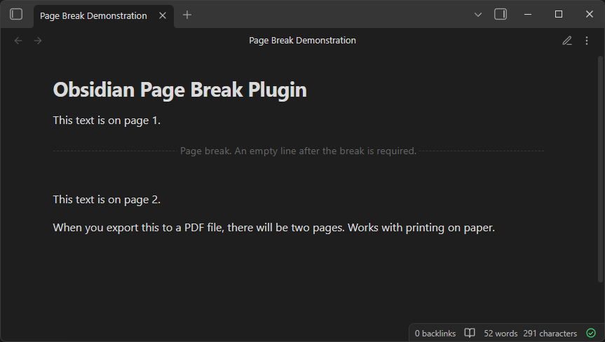

# Obsidian Page Break Plugin

This is an [Obsidian](https://obsidian.md) plugin for adding page breaks to your notes. Page breaks are useful for
keeping notes organized. It is especially aimed at notes exported to PDF and then printed on paper.

## Installation

The plugin hasn't been published to Obsidian's community plugins yet. Manual installation is required.

### Manual Installation

1. Download `main.js`, `manifest.json` and `styles.css` from the latest release. See the [releases page](https://github.com/borrelunde/obsidian-plugin-page-break/releases).
2. Copy the files to the plugin directory `.obsidian/plugins/obsidian-plugin-page-break/` in your vault. 
3. Reload Obsidian and enable the plugin in **Settings → Community plugins**.
